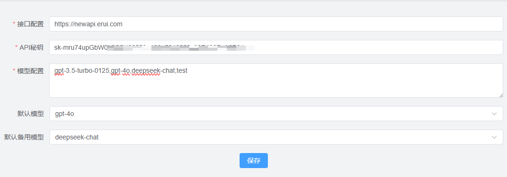
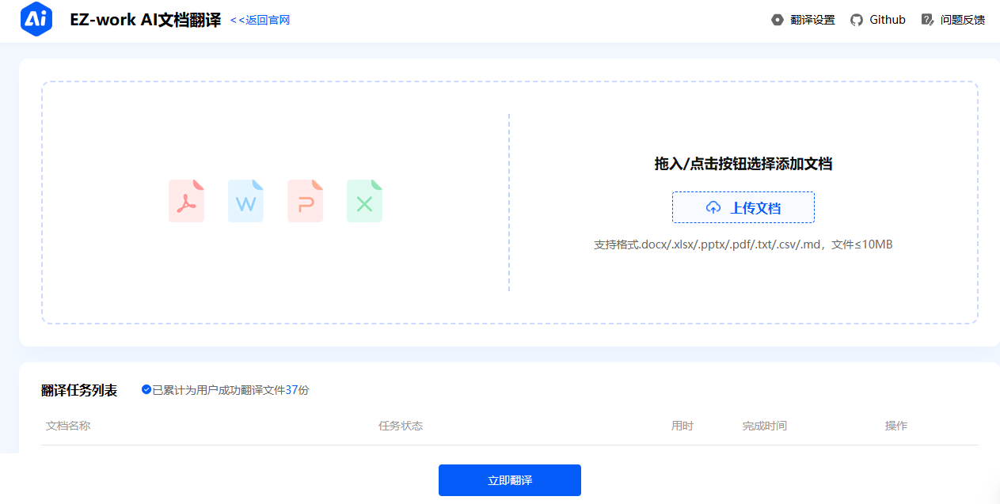
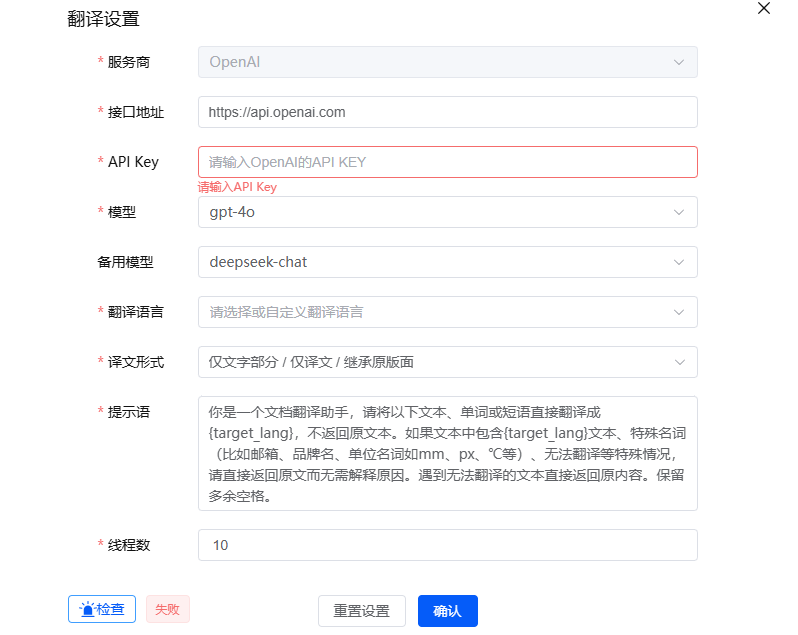
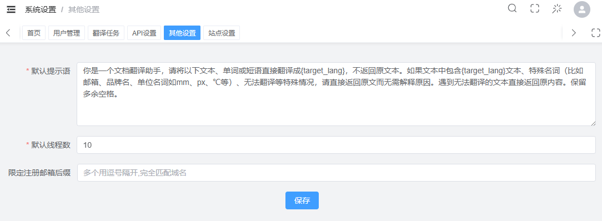

# 使用设置

---

## 访问

前台访问网址：https://ezdemo.erui.com/

## 后台设置

后台访问网址：https://ezdemoadmin.erui.com/login

API设置：

## 前台设置

翻译设置

模型支持：gpt-4o、gpt-3.5-turbo-0125、deepseek-chat

翻译语言支持：中、英、日、俄、西、阿

### 兼容api配置

国内外所有主流AI模型均可转换为OpenAI兼容格式并用于本项目，详细转换请看看[中转API设置篇>>]()

### 提示词设置

登录后台-系统设置-其他设置

输入提示语，设置成功后会在前台默认展示后台设置的提示语

### 术语表（未上线）