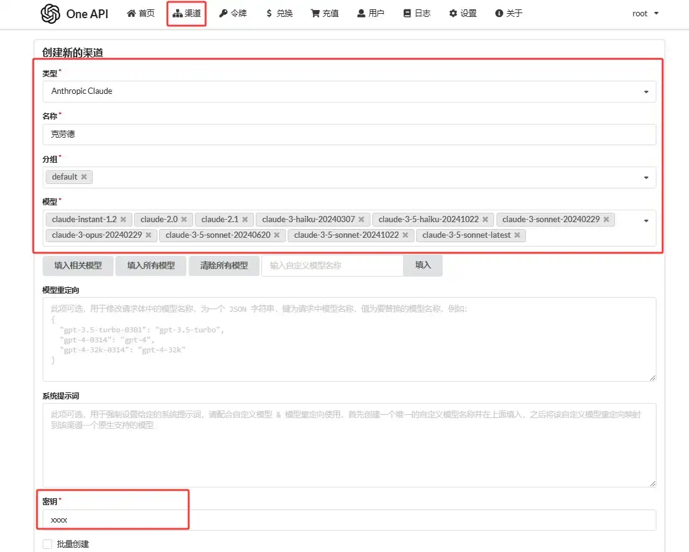
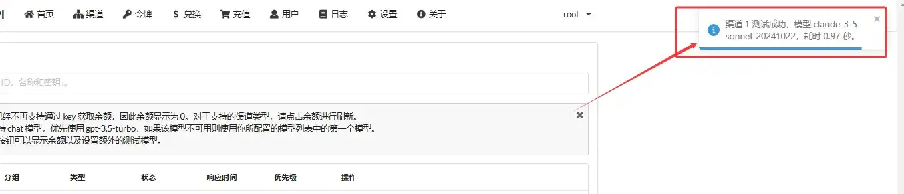

# 中转API设置

---

> 由于EZ-work AI文档翻译仅支持OpenAI兼容API格式对接，所以如果您想使用其它模型API则需要进行格式中转操作。本篇介绍如何将非OpenAI格式的大模型API（如llama、qwen、文心一言、Gemini、Anthropic等）转换为OpenAI兼容格式。

### 项目介绍

One-api是一个完全开源的OpenAI 接口管理 & 分发系统，使用Go语言开发，支持 Azure、Anthropic Claude、Google PaLM 2 & Gemini、智谱 ChatGLM、百度文心一言、讯飞星火认知、阿里通义千问、360 智脑以及腾讯混元，可用于二次分发管理 key，仅单可执行文件，已打包好 Docker 镜像，一键部署，开箱即用. 

项目地址：https://github.com/songquanpeng/one-api

### 1. 项目部署

请基于Docker进行快速部署，部署命令如下：

```ssh
# 使用 SQLite 的部署命令：
docker run --name one-api -d --restart always -p 3000:3000 -e TZ=Asia/Shanghai -v /home/ubuntu/data/one-api:/data justsong/one-api
# 使用 MySQL 的部署命令，在上面的基础上添加 `-e SQL_DSN="root:123456@tcp(localhost:3306)/oneapi"`，请自行修改数据库连接参数，不清楚如何修改请参见下面环境变量一节。
# 例如：
docker run --name one-api -d --restart always -p 3000:3000 -e SQL_DSN="root:123456@tcp(localhost:3306)/oneapi" -e TZ=Asia/Shanghai -v /home/ubuntu/data/one-api:/data justsong/one-api
```

> 并发量小于1万rpm，直接使用SQLite快速部署即可。

更多部署方式请参考项目的[Readme>>](https://github.com/songquanpeng/one-api#%E9%83%A8%E7%BD%B2)

### 2. 项目配置

部署成功后进入项目后台，点开`渠道` ，以Anthropic为例，从官方获取到API-Key之后，在`渠道`中对应完成配置：



渠道配置完成后，点击`测试`，返回测试响应时间证明成功调通。



### 3. 创建令牌

进入`令牌`菜单，创建并放入EZ-work AI进行使用，对应的接口为你当前访问的one-api地址，比如你的访问地址为`https://www.example.com`，则接口为`https://www.example.com/v1`

> 如果你没有服务器，不懂部署，也可直接购买并使用EZ-work API提供的API：[注册送0.5美金，访问地址>>](https://api.ezworkapi.top)
> 
> EZ-work API使用方法[参考此文档>>](https://www.ezworkapi.com/zh/app-access/EZ-workAI.html)